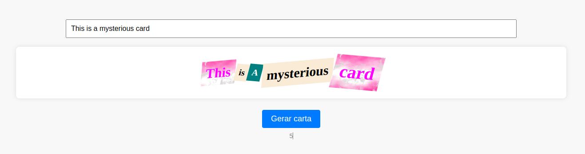

# README: Mysterious Card



## Project Description

This application generates something like an anonymous card using the phrase written in the input. With each click, you can change the letter style. Additionally, there is a word count below the button, indicating how many words the letter contains.

### Technologies

- LINUX
- VSCODE
- HTML
- CSS
- JAVASCRIPT

### What I Learned

- Use logic to generate random numbers and apply then to choose a style
- How to add diferent classes and styles using the same button

## How to Run the Project

1. Clone the repository:

   ```bash
   git clone https://github.com/feduarte-dev/mysterious-card
   ```

2. Navigate to the project directory:

   ```bash
   cd your-repository
   ```

3. Install dependencies:

   ```bash
   npm install
   ```

4. Run application:

   ```bash
   Right click index.html and open it with live server
   ```

## Contributions

[Felipe](https://www.linkedin.com/in/feduarte-dev/) - index.html - style.css - script.js


[Trybe](https://www.betrybe.com/) - Everything else
